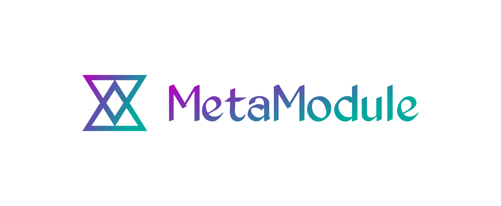

# [logo.metamodule.org](https://logo.metamodule.org) 

## Font

Font in use <a target="_blank" href="http://www.kingthingsfonts.co.uk/fonts/fonts.htm">Kingthings_Exeter</a> designed by
<a target="_blank" href="http://www.kingthingsfonts.co.uk/">Kingthings</a>
and licensed under
<a target="_blank" href="https://www.fontsquirrel.com/license/Kingthings-Calligraphica">Custom EULA.</a>
Icon Designed by
<a target="_blank" href="https://thenounproject.com/mikerowewaves">Mike Rowe</a>

icon designer: Mike Rowe
icon designer link: /mikerowewaves
        

fontColor: {"gradient-0":"#B400BB","gradient-1":"#00AA9D"}
bgColor: {"hex":"transparent"}
iconColor: {"gradient-0":"#B400BB","gradient-1":"#00AA9D"}

## Colors

Font 

    #B400BB, #00AA9D

Background

    transparent

Icon

    #B400BB, #00AA9D    

## 1
[https://logo.metamodule.org/1/cover.png](https://logo.metamodule.org/1/cover.png)

## 2
[https://logo.metamodule.org/2/cover.png](https://logo.metamodule.org/2/cover.png)

## 3
[https://logo.metamodule.org/3/cover.png](https://logo.metamodule.org/3/cover.png)

## 4
[https://logo.metamodule.org/4/cover.png](https://logo.metamodule.org/4/cover.png)

---

+ [edit](https://github.com/meta-module/logo/edit/main/README.md)
+ [meta-module/logo/](https://github.com/meta-module/logo/)
